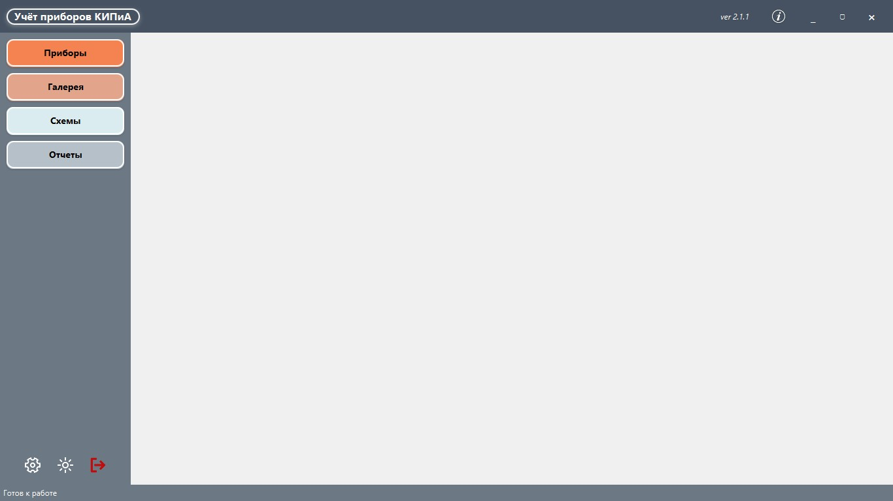

# KIPiA Management System


**KIPiA Management System** — это настольное приложение для управления приборами учета и контроля, с возможностью визуализации схем расположения оборудования, ведения фотоархива и генерации отчетов.

---

## 📋 Содержание
1. [Основные возможности](#-основные-возможности)
2. [Скриншоты интерфейса](#-скриншоты-интерфейса)
3. [Установка и запуск](#-установка-и-запуск)
4. [Технологии](#-технологии)
5. [Структура проекта](#-структура-проекта)
6. [Архитектура приложения](#-архитектура-приложения)
7. [Разработка](#-разработка)
8. [Структура базы данных](#-структура-базы-данных)
9. [Лицензия](#-лицензия)
10. [Контакты и поддержка](#-контакты-и-поддержка)

---

## 🚀 Основные возможности

### 📊 Управление приборами
- **CRUD операции** с приборами (создание, просмотр, редактирование, удаление)
- **Сортировка и поиск** по всей таблице приборов
- **Импорт/экспорт** данных в Excel
- **Валидация данных** при вводе

### 📸 Галерея фотографий
- **Привязка фотографий** к приборам
- **Галерея изображений** с просмотром
- **Управление фото-коллекцией**

### 🗺️ Редактор схем
- **Визуальное расположение** приборов на схемах
- **Рисование фигур** (прямоугольники, эллипсы, ромбы / песочные часы, линии, текст)
- **Привязка приборов** к позициям на схеме
- **Undo/Redo операций**

### 📈 Отчетность
- **Генерация отчетов** по приборам
- **Визуализация данных** с кольцевыми диаграммами (DonutChart на JavaFX)
- **Фильтрация отчетов** по статусу, типу, месту установки, производителю, году

### ⚙️ Дополнительные функции
- **Темная/светлая тема** с переключением на лету
- **Логирование операций** (Log4j2)
- **Работа с буфером обмена**
- **Валидация ячеек таблиц**
- **Синхронизация данных** с разрешением конфликтов при импорте
- **Проверка системного времени** перед операциями с БД
- **Контекстная справка** для каждого раздела приложения
- **Чтение EXIF данных** из фотографий
- **Кросс-платформенная синхронизация** с Android-приложением [KIPiA_Management_Mobile](https://github.com/VladimirShi136/KIPiA_Management_Mobile)

---

## 🖼️ Скриншоты интерфейса

### Главный экран

*Главный экран и навигационное меню*

### Таблица приборов

*Таблица приборов с статистикой*

### Галерея фотографий

*Галерея фотографий с статистикой*

### Редактор схем

*Редактор схем с панелью приборов*

### Отчеты

*Экран с отчетами*
---

## ⚡ Установка и запуск

### Установка через EXE установщик

1. Скачайте последний релиз `KIPiA_Management_*.exe` из раздела [Releases](https://github.com/VladimirShi136/KIPiA_Management/releases)
2. Запустите установщик и следуйте инструкциям
3. Приложение будет установлено в выбранную директорию
4. Запустите через ярлык на рабочем столе или из меню "Пуск"

**Примечание:** EXE установщик требует установленной Java 23+. Java Runtime в установщик не включена.

### Сборка EXE из исходников

#### Предварительные требования
- **Java JDK 23** или выше
- **Maven 3.9+**
- **Inno Setup 6** - установите с [официального сайта](https://jrsoftware.org/isinfo.php)
- **JavaFX SDK 25.0.1** - распакуйте в `C:\javafx-sdk-25.0.1\`

#### Процесс сборки

```bash
# Клонирование репозитория
git clone https://github.com/VladimirShi136/KIPiA_Management
cd KIPiA_Management

# Запуск полной сборки EXE
build-exe-installer.bat
```

Скрипт автоматически выполнит:
1. Очистку предыдущих сборок
2. Сборку JAR через Maven (`mvn clean package`)
3. Создание структуры установщика (копирование JAR, зависимостей, JavaFX)
4. Генерацию ISS файла конфигурации
5. Компиляцию EXE через Inno Setup

Готовый установщик будет находиться в папке `Output\KIPiA_Management_*.exe`

### Запуск JAR напрямую (для разработки)

```bash
# Сборка проекта
mvn clean package

# Запуск (укажите путь к JavaFX SDK)
java --module-path "PATH_TO_JAVAFX_SDK\lib" ^
     --add-modules javafx.controls,javafx.fxml,javafx.graphics,javafx.base ^
     -jar target/KIPiA_Management-*.jar
```

---

## 🛠️ Технологии

- **Язык:** Java 23
- **GUI Framework:** JavaFX 25.0.1
- **База данных:** SQLite 3.42.0.0
- **Сборка:** Maven
- **Библиотеки:**
    - Apache POI 5.4.0 (работа с Excel)
    - Gson 2.10.1 (работа с JSON)
    - Log4j2 2.21.1 (логирование)
    - Apache Commons Lang3 3.16.0 & IO 2.18.0
    - Metadata Extractor 2.19.0 (чтение EXIF из фотографий)

---

## 🗂️ Структура проекта

<pre>
<code>
<b>KIPiA_Management/</b>
│
├── <b>📁 src/</b>                                 <i># Исходный код</i>
│   ├── <b>📁 main/</b>
│   │   ├── <b>📁 java/com/kipia/management/kipia_management/</b>
│   │   │   ├── Main.java
│   │   │   ├── <b>🎮 controllers/</b>            <i># Контроллеры JavaFX</i>
│   │   │   ├── <b>🗃️ models/</b>                <i># Модели данных</i>
│   │   │   ├── <b>⚙️ services/</b>              <i># Сервисы и DAO</i>
│   │   │   ├── <b>🛠️ utils/</b>                <i># Утилиты</i>
│   │   │   ├── <b>🎨 shapes/</b>                <i># Фигуры редактора</i>
│   │   │   └── <b>🧠 managers/</b>              <i># Менеджеры</i>
│   │   └── <b>📁 resources/</b>
│   │       ├── <b>🖼️ views/</b>                <i># FXML файлы</i>
│   │       ├── <b>🎨 styles/</b>                <i># CSS темы</i>
│   │       ├── <b>🖼️ images/</b>               <i># Иконки</i>
│   │       ├── <b>🗃️ data/</b>                 <i># База данных</i>
│   │       └── <b>📝 logs/</b>                  <i># Логи</i>
│   │
├── <b>🔧 build-exe-installer.bat</b>          <i># Главный скрипт сборки EXE</i>
├── <b>🔧 compile-inno-setup.bat</b>          <i># Компиляция ISS через Inno Setup</i>
├── <b>🔧 create-installer-structure.bat</b>   <i># Создание структуры установщика</i>
├── <b>🔧 generate-iss.ps1</b>                 <i># Генерация ISS конфигурации</i>
│   
├── <b>📖 docs/</b>                               <i># Документация</i>
│   ├── USER_GUIDE.md
│   ├── SCHEME_EDITOR_GUIDE.md
│   ├── DEPLOYMENT.md
│   └── <b>🖼️ screenshots/</b>                    <i># Скриншоты к документации</i>
│
├── <b>📦 installer_resources/</b>                <i># Ресурсы установщика</i>
│   ├── KIPiA_Setup.iss
│   ├── ChangeLog.txt
│   ├── CheckEnvironment.bat
│   ├── DebugLauncher.bat
│   └── <b>🖼️ icons/</b>                         <i># Иконки приложения</i>
│
├── <b>📁 device_photos/</b>                     <i># Фотоархив приборов (для разработки)</i>
│
├── <b>📁 Output/</b>                            <i># Собранный установщик .exe</i>
│   └── KIPiA_Management_*.exe
│
├── <b>📁 reserve_scripts/</b>                   <i># Резервные скрипты сборки</i>
│
├── <b>📁 KIPiA_Installer/</b>                   <i># Папка установщика</i>
│
├── <b>⚙️ pom.xml</b>                            <i># Конфигурация Maven</i>
├── <b>📄 README.md</b>                          <i># Вы читаете этот файл</i>
├── <b>📄 LICENSE</b>                            <i># Лицензия MIT</i>
└── <b>📄 .gitignore</b>                         <i># Игнорируемые файлы Git</i>
</code>
</pre>

---

## 📊 Архитектура приложения

### Многослойная архитектура:
```
┌─────────────────────────────────────┐
│ Presentation Layer                  │
│ (JavaFX Controllers + FXML Views)   │
├─────────────────────────────────────┤
│ Business Logic                      │
│ (Services, Managers, Utils)         │
├─────────────────────────────────────┤
│ Data Access                         │
│ (DAOs, Database)                    │
├─────────────────────────────────────┤
│ Database                            │
│ (SQLite файл)                       │
└─────────────────────────────────────┘
```

### Ключевые особенности реализации:

1. **Автосохранение схем** - при переходе между разделами и выходе из приложения
2. **Валидация данных** - кастомные ячейки таблиц с проверкой ввода
3. **Undo/Redo система** - в редакторе схем через CommandManager
4. **Менеджер фотографий** - синглтон для управления фотоархивом
5. **Темы оформления** - светлая/темная тема с переключением на лету
6. **Логирование** - Log4j2 с конфигурируемым уровнем детализации
7. **Синхронизация данных** - экспорт/импорт БД с разрешением конфликтов
8. **Проверка времени** - валидация системного времени перед операциями записи
9. **Контекстная справка** - встроенная система помощи для каждого раздела

### База данных:
- **Файл:**
  - Режим разработки: `src/main/resources/data/kipia_management.db`
  - Режим продакшена: `%APPDATA%/KIPiA_Management/data/kipia_management.db`
- **Таблицы:** devices, schemes, device_locations
- **Автоматическое создание** при первом запуске
- **Миграции:** выполняются автоматически через DatabaseService (soft delete, two-way merge)
- **Синхронизация:** экспорт/импорт в ZIP с разрешением конфликтов

### Обработка ошибок:
- **Пользовательские алерты** (CustomAlert)
- **Повторная попытка запуска** при критических ошибках
- **Логирование всех исключений** в файл логов

---

## 🔧 Разработка

### Настройка среды разработки

- Установите IntelliJ IDEA с поддержкой JavaFX
- Импортируйте проект как Maven проект
- Убедитесь, что установлен JavaFX SDK 25.0.1

### Запуск в IDE

1. Укажите главный класс: `com.kipia.management.kipia_management.Main`
2. VM Options:

   - Для developer (путь к sdk выбрать свой):

`--module-path
"PATH_TO_JAVAFX_SDK\lib"
--add-modules
javafx.controls,javafx.fxml,javafx.graphics,javafx.base
-Dlog4j.configurationFile=src/main/resources/logs/log4j2.xml
--enable-native-access=javafx.graphics,ALL-UNNAMED`

  - Для production (путь к sdk выбрать свой):

`--module-path
"PATH_TO_JAVAFX_SDK\lib"
--add-modules
javafx.controls,javafx.fxml,javafx.graphics,javafx.base
-Dproduction=true
-Dlog4j.configurationFile=file:///%APPDATA%/KIPiA_Management/log4j2.xml
--enable-native-access=javafx.graphics,ALL-UNNAMED`

+ При необходимости, добавить `-Dlog4j2.debug=true` для отладки работы логгера

### База данных

- Используется SQLite с файлом `data/kipia_management.db`
- Миграции выполняются автоматически при запуске
- Резервное копирование: скопируйте файл `kipia_management.db`

---

## 🗃️ Структура базы данных

- ### `devices` (Приборы)
```sql
CREATE TABLE devices (
    id INTEGER PRIMARY KEY AUTOINCREMENT,
    type TEXT NOT NULL,              -- Тип прибора
    name TEXT,                       -- Наименование/модель
    manufacturer TEXT,               -- Производитель
    inventory_number TEXT UNIQUE NOT NULL, -- Инвентарный номер
    year INTEGER,                    -- Год выпуска
    measurement_limit TEXT,          -- Предел измерений
    accuracy_class REAL,             -- Класс точности
    location TEXT NOT NULL,          -- Место установки
    valve_number TEXT,               -- Номер крана/узла
    status TEXT DEFAULT 'В работе',  -- Статус
    additional_info TEXT,            -- Дополнительная информация
    photos TEXT,                     -- Список имён файлов фото, разделённых точкой с запятой (;)
    updated_at INTEGER,              -- Время последнего обновления (мс)
    deleted_at INTEGER DEFAULT 0,    -- Soft delete (0 = активен, >0 = удалён)
    last_synced_at INTEGER DEFAULT 0 -- Время последней синхронизации (мс)
);
```

- ### `schemes` (Схемы)
```sql
CREATE TABLE schemes (
    id INTEGER PRIMARY KEY AUTOINCREMENT,
    name TEXT UNIQUE NOT NULL,      -- Название схемы
    description TEXT,                -- Описание схемы
    data TEXT,                      -- JSON данные схемы
    updated_at INTEGER,              -- Время последнего обновления (мс)
    deleted_at INTEGER DEFAULT 0,    -- Soft delete (0 = активен, >0 = удалён)
    last_synced_at INTEGER DEFAULT 0 -- Время последней синхронизации (мс)
);
```

- ### `device_locations` (Приборы по местоположению)
```sql
CREATE TABLE device_locations (
    device_id INTEGER NOT NULL,      -- ID прибора
    scheme_id INTEGER NOT NULL,      -- ID схемы
    x REAL NOT NULL,                 -- Координата X
    y REAL NOT NULL,                 -- Координата Y
    rotation REAL DEFAULT 0.0,       -- Поворот в градусах
    updated_at INTEGER,              -- Время последнего обновления (мс)
    deleted_at INTEGER DEFAULT 0,    -- Soft delete (0 = активен, >0 = удалён)
    last_synced_at INTEGER DEFAULT 0, -- Время последней синхронизации (мс)
    PRIMARY KEY (device_id, scheme_id),
    FOREIGN KEY (device_id) REFERENCES devices(id) ON DELETE CASCADE,
    FOREIGN KEY (scheme_id) REFERENCES schemes(id) ON DELETE CASCADE
);
```

---

## 📄 Лицензия

Этот проект распространяется под лицензией **MIT License**.

Полный текст лицензии доступен в файле [LICENSE](LICENSE).

**Коротко о сути лицензии MIT:**
*   ✅ **Можно:** свободно использовать, копировать, изменять, публиковать, распространять и продавать ПО.
*   ✅ **Можно:** использовать в коммерческих закрытых проектах.
*   ⚠️ **Условие:** во всех копиях или существенных частях должна быть сохранена данная информация об авторском праве и текст лицензии.
*   ❌ **Без гарантий:** автор не несёт ответственности за возможные проблемы при использовании ПО.

---

## 📞 Контакты и поддержка

* Автор: [VladimirShi136](https://github.com/VladimirShi136)
* Issues: [Перейти к вопросам и задачам](https://github.com/VladimirShi136/KIPiA_Management/issues)
* Документация: [Перейти к Wiki](https://github.com/VladimirShi136/KIPiA_Management/wiki)

**_Примечание:_** Для полной документации с пошаговыми инструкциями и скриншотами обратитесь к Wiki проекта.

---