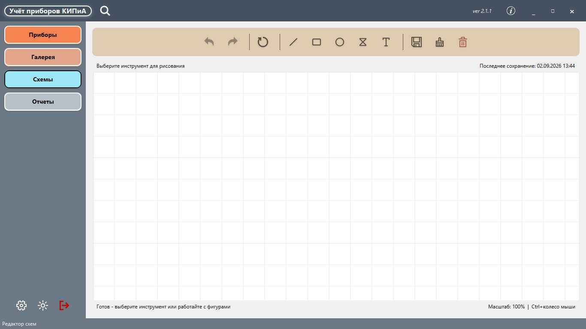
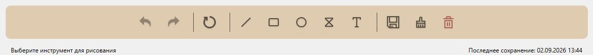
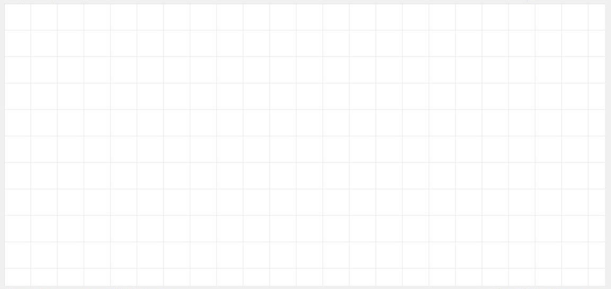
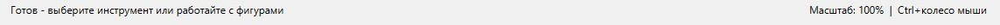
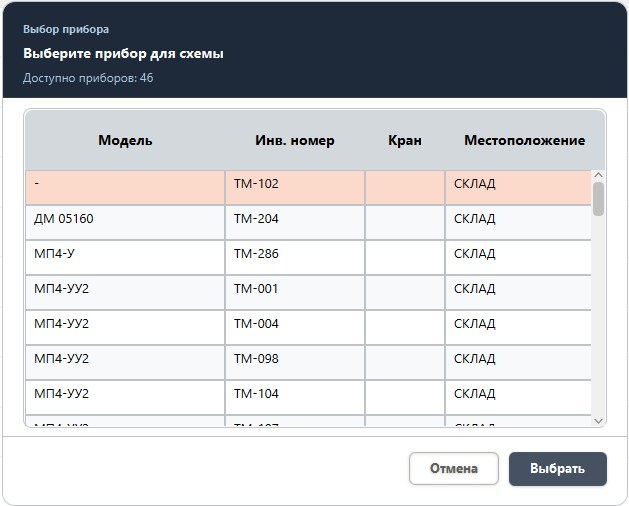

# 🗺️ Руководство по редактору схем

## Оглавление
1. [Быстрый старт](#1-быстрый-старт)
2. [Интерфейс редактора](#2-интерфейс-редактора)
3. [Инструменты рисования](#3-инструменты-рисования)
4. [Работа с приборами](#4-работа-с-приборами)
5. [Редактирование элементов](#5-редактирование-элементов)
6. [Управление схемами](#6-управление-схемами)
7. [Горячие клавиши](#7-горячие-клавиши)
8. [Частые вопросы](#8-частые-вопросы)
9. [Техническая поддержка](#-техническая-поддержка)

---

## 1. Быстрый старт

### 1.1 Открытие редактора
1. В навигационном меню нажмите "Схемы"
2. Выберите схему из выпадающего списка в поисковой системе в шапке
3. Начните редактирование

### 1.2 Первые шаги
1. **Выберите инструмент** из панели инструментов
2. **Кликните на холсте** для создания элемента
3. **Перетащите** для определения размера
4. **Используйте ручки** для изменения формы

---

## 2. Интерфейс редактора

*Главное окно редактора схем*

### 2.1 Панель инструментов

### 2.2 Рабочая область

### 2.3 Панель статуса

---

## 3. Инструменты рисования

### 3.1 Линия (`─`)
**Назначение:** Соединение элементов, обозначение трубопроводов

**Использование:**
1. Нажмите кнопку "Линия"
2. Кликните на холсте для начала линии
3. Перетащите до конечной точки
4. Отпустите для завершения

**Свойства:**
- Цвет: черный по умолчанию
- Толщина: 1px
- Стиль: сплошная

### 3.2 Прямоугольник (`▭`)
**Назначение:** Обозначение помещений, оборудования, блоков

**Использование:**
1. Нажмите кнопку "Прямоугольник"
2. Кликните и перетащите для определения размеров
3. Отпустите для создания

**Свойства:**
- Заливка: прозрачная
- Обводка: черная, 1px
- Углы: прямые

### 3.3 Эллипс (`○`)
**Назначение:** Круглые объекты, резервуары, цистерны

**Использование:** Аналогично прямоугольнику

**Свойства:**
- Заливка: прозрачная
- Обводка: черная, 1px

### 3.4 Песочные часы/Бабочка (`⏳`) - Кран
**Назначение:** Обозначение кранов, задвижек, арматуры

**Использование:**
1. Нажмите кнопку "Кран"
2. Кликните и перетащите для определения размера
3. Автоматически получает форму "песочных часов" (два треугольника, сходящихся в центре)

**Особенности:**
- Автоматическое позиционирование
- Возможность поворота
- Фигура состоит из двух треугольников, образующих форму песочных часов

### 3.5 Текст (`T`)
**Назначение:** Подписи, обозначения, комментарии

**Использование:**
1. Нажмите кнопку "Текст"
2. Кликните на холсте в нужном месте
3. Введите текст в диалоговом окне
4. Нажмите OK

**Свойства:**
- Шрифт: Arial, 12pt
- Цвет: черный
- Выравнивание: по центру

---

## 4. Работа с приборами

### 4.1 Добавление прибора на схему

#### Контекстное меню
1. Правый клик на пустой области схемы
2. Выберите "Добавить прибор"
3. Выберите прибор из списка
4. Нажмите "Выбрать"

### 4.2 Редактирование прибора на схеме

**Перемещение:**
1. Выберите прибор (клик левой кнопкой)
2. Перетащите в нужное место
3. Отпустите для установки

**Поворот:**
1. Нажмите правой кнопкой мыши на прибор
2. Нажмите "Повернуть"
3. Выбирайте нужный угол

### 4.3 Удаление прибора со схемы
1. Нажмите правой кнопкой мыши на прибор
2. Нажмите "Удалить прибор"
3. Подтвердите удаление

- Также можно посмотреть подробную информацию и фотографии прибора.
- **Важно:** Удаление со схемы не удаляет прибор из базы данных!

---

## 5. Редактирование элементов

### 5.1 Выделение элементов
- **Двойной клик левой кнопкой мыши** - выделение элемента
- ~~**Ctrl+клик** - добавление/удаление из выделения~~ (в разработке)
- ~~**Прямоугольное выделение** - перетащите мышью с зажатой левой кнопкой~~ (удалено)
- **Клик по инструменту** - отключение выделения и сброс инструмента

### 5.2 Изменение свойств

#### Для фигур:
1. Выделите фигуру
2. Появятся ручки изменения:
    - **Угловые ручки** - изменение размера
    ~~- **Центральная точка** - перемещение фигуры~~ (удалено)

#### Для текста:
1. Выделите текст (двойной клик или одиночный клик)
2. Текст будет обведен синей рамкой
3. Для редактирования используйте контекстное меню (правый клик) → "Изменить текст"

### 5.3 Копирование и вставка
1. Выделите элемент (фигуру или текст)
2. `Ctrl+C` - копировать
3. Кликните в нужное место
4. `Ctrl+V` - вставить
5. Перетащите копию в нужную позицию

### 5.4 Группировка элементов
*(В разработке)*

---

## 6. Управление схемами

### 6.1 Создание новой схемы
**Автоматическое создание:**
- Система автоматически создает схемы по местам установки приборов
- Название схемы = место установки
- Все приборы с этим местом установки доступны для добавления
- Удалить схему полностью можно только если ни один прибор не будет на неё ссылаться

### 6.2 Загрузка схемы
1. Выберите схему из выпадающего списка в поисковой системе в шапке приложения
2. Система автоматически загрузит:
    - Все фигуры
    - Размещенные приборы
    - Позиции элементов

### 6.3 Сохранение схемы

#### Автоматическое сохранение:
- При переходе в другой раздел приложения
- При переходе на другую схему
- При выходе из приложения

#### Ручное сохранение:
1. Нажмите кнопку "Сохранить схему" 💾
2. Дождитесь подтверждения
3. Продолжайте работу

### 6.4 Очистка схемы
1. Нажмите кнопку "Очистить схему"
2. Подтвердите действие
3. Все элементы будут удалены

**Внимание:** Очистка удаляет все фигуры и приборы со схемы!

---

## 7. Горячие клавиши

### Общие:
Ctrl+Z - Отменить последнее действие (Undo)
Ctrl+Shift+Z или Ctrl+Y - Повторить отмененное действие (Redo)
Ctrl+C - Копировать выделенный элемент
Ctrl+V - Вставить скопированный элемент
Delete / Backspace - Удалить выделенный элемент
Esc - Снять выделение с фигуры и сбросить инструмент

### Инструменты:
L - Инструмент "Линия"
R - Инструмент "Прямоугольник"
E - Инструмент "Эллипс"
K - Инструмент "Кран" (Песочные часы/Бабочка)
T - Инструмент "Текст"

### Навигация:
Ctrl+колесо мыши - Масштабирование (zoom 50%-300%)
Средняя кнопка мыши или Ctrl+левая кнопка - Панорамирование (перемещение по холсту)
Кнопка "Сброс вида" - Возврат к масштабу 100% и центрированию

---

## 8. Частые вопросы

### 8.1 Почему не сохраняются изменения?
**Возможные причины:**
1. Не выбрана схема из списка
2. Нет прав на запись в папку данных
3. База данных заблокирована

**Решение:**
1. Убедитесь, что схема выбрана в выпадающем списке
2. Проверьте наличие папки `%APPDATA%/KIPiA_Management/data/`
3. Перезапустите приложение

### 8.2 Как добавить несколько одинаковых приборов?
1. Добавьте первый прибор через контекстное меню
2. Выделите добавленный прибор
3. `Ctrl+C` - скопируйте
4. `Ctrl+V` - вставьте копию
5. Перетащите копию в нужное место

### 8.3 Почему приборы не отображаются на схеме?
**Причины:**
1. Прибор не привязан к текущей схеме
2. Прибор находится за пределами видимой области

**Решение:**
1. Убедитесь, что прибор имеет то же "Место установки", что и название схемы
2. Проверьте, не скрыт ли прибор слоем

### 8.4 Как изменить цвет фигуры?
1. Нажимаем правой кнопкой мыши на фигуру
2. В контекстном меню выбираем изменение цвета контура или заливки

### 8.5 Можно ли импортировать чертеж как фон?
*(В разработке)*

---

## 📞 Техническая поддержка

При возникновении проблем:
1. Проверьте файл логов `logs/kipia-management-dev.log` в разработке, либо `logs/kipia-management.log` в продакшен
2. Опишите проблему как можно подробнее
3. Укажите версию приложения и операционную систему
4. Свяжитесь с разработчиком или создайте Issue в репозитории

**Версия редактора:** 2.1.1
**Последнее обновление:** 02.09.2026

---