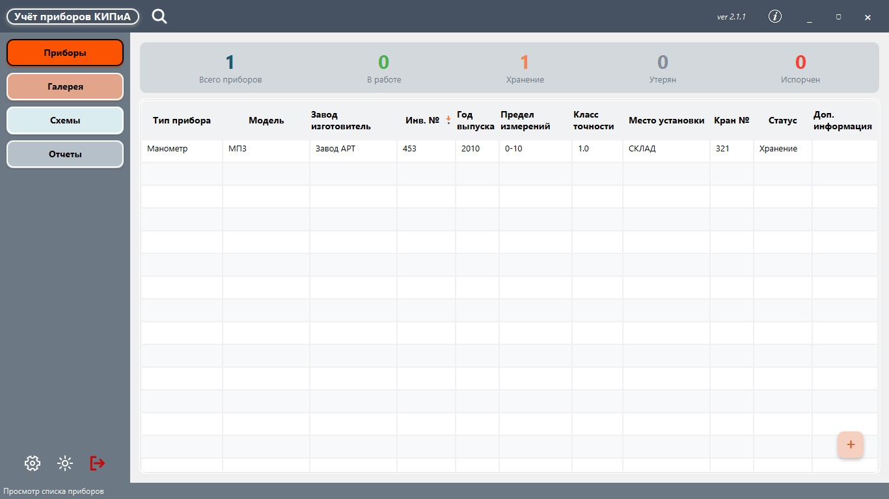
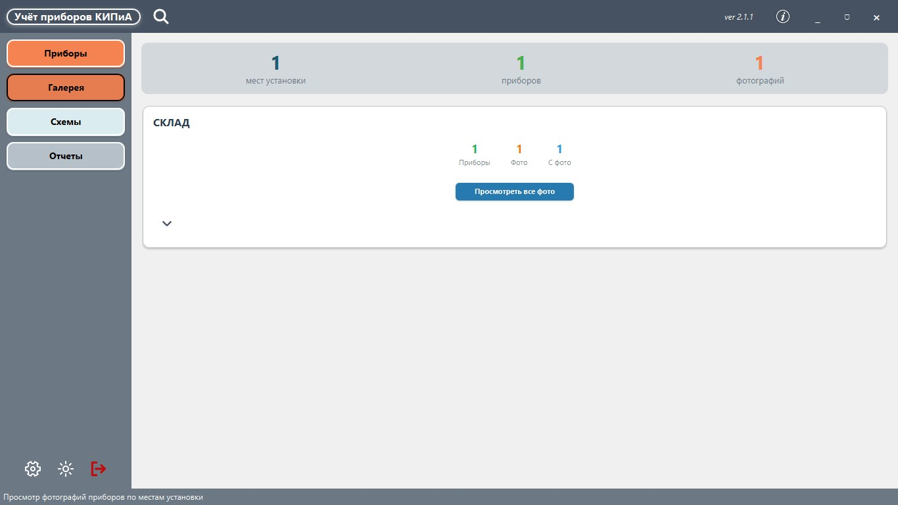
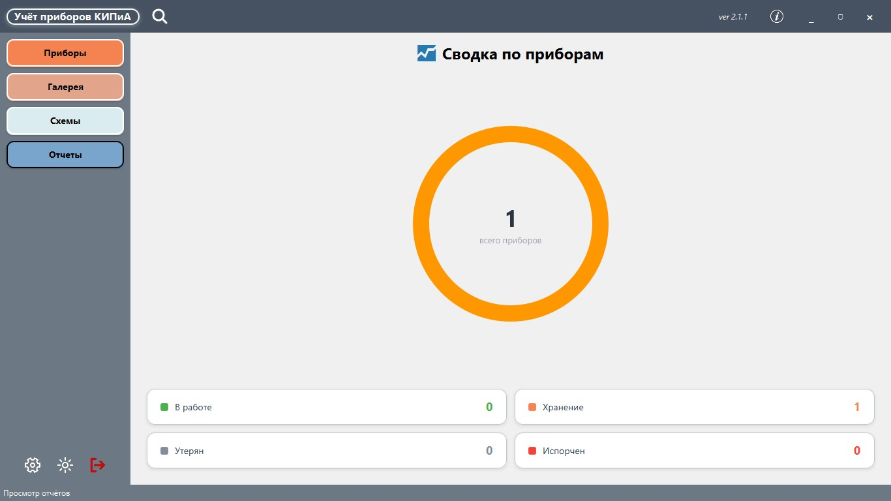

# 📘 Руководство пользователя KIPiA Management System

## Содержание
1. [Начало работы](#1-начало-работы)
2. [Главный экран](#2-главный-экран)
3. [Управление приборами](#3-управление-приборами)
4. [Редактор схем](#4-редактор-схем)
5. [Фотогалерея](#5-фотогалерея)
6. [Отчеты](#6-отчеты)
7. [Настройки](#7-настройки)
8. [Частые вопросы](#8-частые-вопросы)
9. [Структура данных](#9-структура-данных)
10. [Импорт и экспорт данных](#10-импорт-и-экспорт-данных)
11. [Поиск и фильтрация](#11-поиск-и-фильтрация)
12. [Работа с данными](#12-работа-с-данными)
13. [Удаление данных](#13-удаление-данных)
14. [Техническая поддержка](#-техническая-поддержка)

---

## 1. Начало работы

### 1.1 Системные требования
- **Java 23** или выше
- **JavaFX 25.0.1**
- **Windows 10/11** (рекомендуется)

### 1.2 Сборка перед запуском
```bash
# Клонирование репозитория
git clone https://github.com/VladimirShi136/KIPiA_Management
cd KIPiA_Management

# Сборка проекта
mvn clean package

# Запуск приложения (впишите текущую версию)
java -jar target/KIPiA_Management-*.*.*.jar
```

### 1.3 Первый запуск
При первом запуске приложения:
1. Автоматически создается база данных SQLite в папке `data/`
2. Инициализируются все необходимые таблицы
3. Загружается интерфейс со светлой темой по умолчанию

### 1.4 Главное окно
После запуска вы увидите:
- **Верхняя панель** - поисковая система
- **Левое меню** - навигация по разделам
- **Центральная область** - рабочее пространство
- **Строка состояния** - текущий статус и уведомления

---

## 2. Главный экран

### 2.1 Навигационное меню

```
[📋] Приборы - Список всех приборов
[📸] Галерея - Архив фотографий оборудования
[🗺️] Схемы  - Визуальное расположение приборов на схемах
[📈] Отчёты - Генерация и просмотр отчетов
[🌙] Тема - Переключение светлой/темной темы
[] Настройки - экспорт/импорт данных
[🚪] Выход - Завершение работы приложения
```

### 2.2 Строка состояния
Отображает:
- Текущий активный раздел
- Сообщения о выполненных операциях
- Предупреждения и ошибки

---

## 3. Управление приборами

### 3.1 Просмотр списка приборов
**Раздел:** "Приборы"


*Таблица с приборами*

Функции:
- **Фильтрация/Поиск** - поиск по всей таблице
- **Сортировка** - клик по заголовку колонки
- **Редактирование** - контекстное меню правой кнопкой мыши
- **Удаление** - контекстное меню правой кнопкой мыши
- **Добавить прибор** - через кнопку "+"

### 3.2 Добавление нового прибора
**Раздел:** "Добавить прибор"

Обязательные поля:
1. **Модель** - уникальное название
2. **Тип прибора** - выбирается из списка
3. **Инвентарный номер** - уникальный идентификатор
4. **Место установки** - где расположен прибор
5. **Статус** - статус прибора (Хранение, В работе и т.д.)

Дополнительные поля:
- **№ Крана** - местоположение на схеме
- **Предел измерений** - мин/макс значения
- **Класс точности** - точность измерений прибора
- **Производитель** - завод изготовитель
- **Год выпуска** - год создания прибора
- **Доп. информация** - примечание
- **Фото** - привязать фото прибора

---

## 4. Редактор схем

### 4.1 Обзор редактора
Редактор схем позволяет визуализировать расположение приборов на планах помещений.


*Холст редактора схем*

**Основные элементы:**
🖌️ Панель инструментов - Фигуры, undo/redo, операции над схемой
📐 Рабочая область - Холст для рисования
📋 Список приборов - через контекстное меню -> "Добавить прибор"
🎨 Контекстное меню  - Настройка выбранного элемента

### 4.2 Создание схемы

* Схемы создаются автоматически пустыми по названию локаций

### 4.3 Добавление приборов на схему
1. Нажмите правой кнопкой мыши на холсте → добавить прибор
2. Выберите из списка нужный прибор
3. Прибор установлен на холсте, перетягиваем в нужное положение
4. Каждый прибор на схеме это существующий прибор из базы данных

### 4.4 Рисование фигур
Доступные фигуры:
- **Прямоугольник** - для обозначения помещений
- **Эллипс** - для круглых объектов
- **Линия** - для соединения элементов (с автоматической привязкой к другим линиям)
- **Текст** - для подписей (с возможностью изменения шрифта)
- **Ромб (бабочка)** - для специальных обозначений

### 4.4.1 Редактирование фигур
- **Поворот** - через контекстное меню (поворот на 45°)
- **Изменение цвета** - через контекстное меню
- **Изменение шрифта текста** - через контекстное меню
- **Копирование/Вставка** - через контекстное меню или горячие клавиши
- **Удаление** - через контекстное меню или клавишу Delete

### 4.5 Горячие клавиши в редакторе
**Управление фигурами:**
- L - Инструмент "Линия"
- R - Инструмент "Прямоугольник"
- E - Инструмент "Эллипс"
- K - Инструмент "Кран" (Песочные часы/Бабочка)
- T - Инструмент "Текст"
- Esc - Снять выделение с фигуры

**Управление:**
- Ctrl + C - Копировать выбранный элемент
- Ctrl + V - Вставить скопированный элемент
- Delete - Удалить выбранный элемент
- Ctrl + Z - Отменить последнее действие (Undo)
- Ctrl + Y - Повторить отмененное действие (Redo)

### 4.6 Автосохранение
Система автоматически сохраняет схему:
- При переходе в другой раздел
- При переходе в другую схему
- При выходе из приложения

### 4.7 Масштабирование и навигация
- **Zoom** - Ctrl + колесико мыши для увеличения/уменьшения
- **Pan** - Ctrl + левая кнопка мыши для перемещения по холсту
- **Сброс масштаба** - кнопка в панели управления

### 4.8 Выделение текста
- Двойной клик по тексту выделяет его синей рамкой
- Выделенный текст можно копировать, вставлять и удалять через горячие клавиши
- Редактирование текста доступно через контекстное меню (правый клик → "Изменить текст")

### 4.9 Темная тема
- В темной теме черные фигуры автоматически получают белую обводку для лучшей видимости
- Обводка применяется к: прямоугольникам, эллипсам, ромбам, линиям и тексту
- Обводка автоматически скрывается при переключении на светлую тему

---

## 5. Фотогалерея


*Карточки с локациями и фотографиями приборов*

### 5.1 Добавление фотографий
1. Выберите прибор из списка
2. Нажмите "Добавить фото"
3. Выберите изображение с компьютера
4. Добавить / Удалить фото можно в таблице приборов в окне редактирования нужного прибора

### 5.2 Просмотр фотографий
- **Просмотр фото** - все фото конкретного прибора
- **Просмотреть все фото** - фото всех приборов в определенном месте
- **Зум режим** - левой кнопкой по фотографии

### 5.3 Управление фотографиями
- **Удаление** - кнопка на панели
- **Открыть в системном приложении** - кнопка на панели
- **Просмотр EXIF данных** - при загрузке фото автоматически считываются метаданные (дата съемки, камера, настройки)
- **Лимит фотографий** - максимум 10 фото на один прибор (при превышении удаляется самое старое фото)

---

## 6. Отчеты


*Форма с отчетами в виде круговой диаграммы*

### 6.1 Генерация отчета
- Отчеты генерируются автоматически в виде круговой диаграммы

### 6.2 Фильтрация отчетов
- Фильтрация по типу прибора
- Фильтрация по месту установки
- Фильтрация по производителю
- Фильтрация по статусу
- Фильтрация по году выпуска

---

## 7. Настройки

### 7.1 Окно настроек
Раздел "Настройки" предназначен для управления данными приложения.

**Доступные функции:**
- **Экспорт БД** - экспорт всей базы данных (включая фотографии) в ZIP-архив
- **Импорт БД** - импорт данных из ZIP-архива с синхронизацией и разрешением конфликтов
- **Экспорт в Excel** - экспорт таблицы приборов в Excel файл
- **Импорт из Excel** - импорт приборов из Excel файла
- **История операций** - отображение времени последнего экспорта/импорта

### 7.3 Темы оформления
**Переключение темы:** Кнопка "Тема" в главном меню

Доступные темы:
- **Светлая** - по умолчанию, меньше нагрузки на глаза
- **Темная** - удобна для работы в темное время суток

### 7.4 Настройки базы данных
Расположение файла БД: `%APPDATA%/KIPiA_Management/data/kipia_management.db`

**Рекомендации:**
- Регулярно делайте резервные копии файла БД
- Не перемещайте файл БД во время работы приложения

### 7.5 Логирование
Файлы логов находятся в папке `logs/`:
1. development - `logs/kipia-management-dev.log`
   - `kipia-management-dev.log` - основные логи
   - `log4j2.xml` - конфигурация логирования
2. production - `%APPDATA%/KIPiA_Management/logs/`

Уровни логирования:
- ERROR - критические ошибки
- WARN - предупреждения
- INFO - информационные сообщения
- DEBUG - отладочная информация

### 7.6 Контекстная помощь
- **F1** - вызов справки по текущему разделу
- **!** кнопка в правом верхнем углу - контекстная подсказка
- Подсказки содержат информацию о доступных действиях в текущем разделе

---

## 8. Частые вопросы

### 8.1 Как сделать резервную копию данных?
1. В настройках приложения сделать экспорт БД (вместе с фотографиями)

или:

1. Закройте приложение
2. Скопируйте файл `%APPDATA%/KIPiA_Management/data/`
3. Сохраните в надежном месте

### 8.2 Прибор не отображается на схеме
Возможные причины:
1. Прибор не привязан к текущей схеме
2. Прибор находится за пределами видимой области

Решение:
1. Проверьте привязку прибора в редакторе схем
2. Поиск ползунком за пределами видимой схемы

### 8.3 Фотографии не загружаются
Проверьте:
1. Фото удалено из папки
2. Права доступа к папке приложения

### 8.4 Ошибка подключения к базе данных
Действия:
1. Проверьте, не открыт ли файл БД в другой программе
2. Убедитесь, что папка `%APPDATA%/KIPiA_Management/data/` существует
3. Попробуйте перезапустить приложение

### 8.5 Как обновить приложение?
1. Скачайте новую версию
2. Сохраните файл БД из старой версии
3. Установите новую версию
4. Скопируйте сохраненный файл БД в папку `%APPDATA%/KIPiA_Management/data/`

### 8.6 Как проверить системное время?
Приложение автоматически проверяет системное время при запуске.
- Если системное время некорректно, отображается предупреждение
- Некорректное время может влиять на корректность работы с датами (например, EXIF данных фотографий)

### 8.7 Как использовать буфер обмена?
- Выделите фигуру → Ctrl+C для копирования
- Ctrl+V для вставки скопированной фигуры
- Фигуры можно копировать между схемами

---

## 9. Структура данных

### 9.1 Поля прибора
Каждый прибор содержит следующую информацию:

**Основные данные:**
- **Тип прибора** - категория (Измерительный, Контрольный и т.д.)
- **Наименование** - модель/серия прибора
- **Производитель** - завод-изготовитель
- **Инвентарный номер** - уникальный идентификатор (обязательное поле)
- **Год выпуска** - год производства

**Технические характеристики:**
- **Предел измерений** - диапазон измерений (например: "0-100°C")
- **Класс точности** - числовое значение точности
- **Номер крана/узла** - идентификатор точки подключения

**Местонахождение:**
- **Место установки** - физическое расположение 
- **Статус** - текущее состояние прибора (обязательное поле): 
    - `В работе` - активно используется
    - `Хранение` - находится на складе
    - `Утерян` - местоположение неизвестно
    - `Испорчен` - неисправен, требует ремонта

**Дополнительно:**
- **Дополнительная информация** - произвольные заметки
- **Фотографии** - до 10 изображений на прибор

### 9.2 Статусы приборов
| Статус   | Цвет      | Описание                             |
|----------|-----------|--------------------------------------|
| В работе | Зеленый   | Прибор используется по назначению    |
| Хранение | Оранжевый | Прибор на складе, в резерве          |
| Утерян   | Серый     | Местоположение неизвестно            |
| Испорчен | Красный   | Неисправен, требует ремонта/списания |

### 9.3 Валидация данных
При вводе данных проверяется:
1. **Инвентарный номер** - должен быть уникальным
2. **Тип прибора** - обязательное поле
3. **Год выпуска** - должен быть в диапазоне 1900-текущий год
4. **Класс точности** - только положительные числа через "."
5. **Валидация ячеек таблицы** - некорректные значения подсвечиваются красным
6. **Автоматическая проверка** - при редактировании ячейки проверяется формат данных

---

## 10. Импорт и экспорт данных

### 10.1 Экспорт в Excel
**Формат файла:** `.xlsx` (Excel 2007+)

**Содержимое файла:**
- Все столбцы таблицы приборов
- Автоматическая ширина колонок

**Как экспортировать:**
1. Откройте раздел "Настройки"
2. Нажмите кнопку "Экспорт в Excel"
3. Выберите папку для сохранения
4. Укажите имя файла
5. Нажмите "Сохранить"

### 10.2 Импорт из Excel
**Требования к файлу:**
- Формат `.xlsx` или `.xls`
- Для образца и правильного импорта можно экспортировать пустую таблицу из приложения

**Процесс импорта:**
1. Нажмите кнопку "Импорт из Excel"
2. Выберите файл Excel
3. Проверьте результат в приложении

### 10.3 Синхронизация данных

Функция синхронизации позволяет объединять данные из разных источников с разрешением конфликтов.

**Поддерживаемые источники:**
- Данные из другого экземпляра KIPiA_Management (Windows)
- Данные из Android-приложения [KIPiA_Management_Mobile](https://github.com/VladimirShi136/KIPiA_Management_Mobile)

**Процесс синхронизации:**
1. Выберите "Импорт БД" в меню настроек
2. Загрузите файл с данными для синхронизации
3. При обнаружении конфликтов выберите действие:
   - **Пропустить** - оставить текущее значение
   - **Заменить** - использовать значение из файла
   - **Объединить** - объединить данные (если возможно)

**Типы конфликтов:**
- Дубликаты инвентарных номеров
- Различия в полях одного прибора
- Удаленные/добавленные записи

### 10.4 Резервное копирование базы данных
**Ручное копирование:**
1. Закройте приложение
2. Найдите файл базы данных:
    - Режим разработки: `src/main/resources/data/kipia_management.db`
    - Режим продакшена: `%APPDATA%/KIPiA_Management/data/kipia_management.db`
3. Скопируйте файл в надежное место

---

## 11. Поиск и фильтрация

### 11.1 Поиск по таблице

**Поле поиска** находится в верхней панели приложения

**Что ищется:**
- Наименование прибора
- Инвентарный номер
- Место установки
- Номер крана/узла
- Производитель
- Дополнительная информация

**Особенности поиска:**
- Регистронезависимый
- Поиск по частичному совпадению
- Автоматическое обновление при вводе
- Очистка поиска - удаление текста

### 11.2 Фильтрация по статусам
Смотрите цветовые индикаторы в статистике

### 11.3 Сортировка
**Способы сортировки:**
1. **Клик по заголовку колонки** - сортировка по возрастанию
2. **Повторный клик** - сортировка по убыванию
3. **Третий клик** - сброс сортировки

**Сортируемые колонки:**
- Все колонки сортируемые

---

## 12. Работа с данными

### 12.1 Режимы работы базы данных

* **_Режим разработки_** - база данных в `src/main/resources/data/`
  Определяется автоматически при запуске из IDE.
  Можно принудительно включить: `-Ddevelopment=true`

* **_Продакшен режим_** - база данных в `%APPDATA%/KIPiA_Management/data/`
  Используется при запуске из JAR файла.
  Можно принудительно включить: `-Dproduction=true`

### 12.2 Расположение файлов

- #### В режиме разработки:
```
project/
├── src/main/resources/
│   ├── data/kipia_management.db     # База данных
│   ├── images/                      # Иконки
│   ├── views/                       # FXML файлы
│   ├── styles/                      # CSS темы
│   └── logs/                        # Логи
```

- #### В режиме продакшена:
```
%APPDATA%/
└── KIPiA_Management/
    ├── data/kipia_management.db     # База данных
    └── logs/                        # Логи приложения
```

---

## 13. Удаление данных

### 13.1 Удаление одного прибора
**Способы:**
1. Нажмите правой кнопкой мыши на  прибор → "Удалить" (иконка 🗑️)

**Подтверждение:**
- Запрос подтверждения перед удалением
- Отображение информации об удаляемом приборе
- Возможность отмены операции

### 13.2 Восстановление данных
**После удаления:**
- Данные сразу удаляются из базы
- Восстановление возможно только из резервной копии
- Рекомендуется регулярное резервное копирование

---

## 📞 Техническая поддержка

При возникновении проблем:
1. Проверьте файл логов: 
   - development - `logs/kipia-management-dev.log`
   - production - `%APPDATA%/KIPiA_Management/logs/`
2. Опишите проблему как можно подробнее
3. Укажите версию приложения и операционную систему
4. Свяжитесь с разработчиком или создайте Issue в репозитории

**Версия приложения:** 2.1.1
**Последнее обновление:** 02.09.2026

---